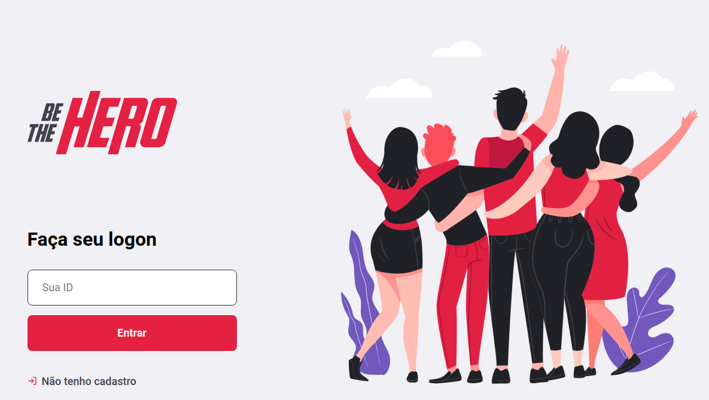

<h1 align="center">
    
</h1>

<p align="center">
  

  
	
  <a href="https://github.com/vitormiacri/be-the-hero/commits/master">
    
  </a>
</p>

## Projeto

Este projeto foi desenvolvido durante a semana Omnistack da @Rocketseat.
O Be The Hero visa conectar pessoas interessadas em ajudar ONGs.

<h1 align="center">
    
</h1>

## Tecnologias

Este projeto foi desenvolvido com as seguintes tecnologias:

- [Node.js](https://nodejs.org/en/)
- [React](https://reactjs.org)
- [React Native](https://facebook.github.io/react-native/)
- [Expo](https://expo.io/)

## Como usar

Para clonar e executar este projeto, você precisa ter instalado em seu computador o [Git](https://git-scm.com), [Node.js][nodejs] + [Yarn][yarn].

### Executar a API

No terminal execute:

```bash
# Clone este repositório
$ git clone https://github.com/vitormiacri/be-the-hero be-the-hero

# Entre na pasta backend
$ cd be-the-hero/backend

# Instale as dependências
$ yarn install

# Crie o banco de dados
$ yarn knex migrate:latest

# Execute a API
$ yarn dev
```

Para visualizar os endpoints da API utilize o Insomnia clicando no botão abaixo:

[](https://insomnia.rest/run/?label=Be%20The%20Hero&uri=https%3A%2F%2Fraw.githubusercontent.com%2Fvitormiacri%2Fbe-the-hero%2Fmaster%2Fbackend%2FInsomnia_requests.json)

### Executar o Frontend

```bash
# Entre na pasta frontend
$ cd be-the-hero/frontend

# Instale as dependências
$ yarn install

# Execute o servidor web
$ yarn start
```

### Registros iniciais

- O banco de dados já possui alguns registros, ulitize o código _**77c95355**_ para se autenticar no sistema.

## :memo: License

This project is under the MIT license. See the [LICENSE](LICENSE.md) for details.

---

Made with ♥ by Vitor Morelli :wave: [Get in touch!](https://www.linkedin.com/in/vitor-morelli-miacri-5830b431/)

[nodejs]: https://nodejs.org/
[yarn]: https://yarnpkg.com/
[vc]: https://code.visualstudio.com/
[vceditconfig]: https://marketplace.visualstudio.com/items?itemName=EditorConfig.EditorConfig
[vceslint]: https://marketplace.visualstudio.com/items?itemName=dbaeumer.vscode-eslint
[prettier]: https://marketplace.visualstudio.com/items?itemName=esbenp.prettier-vscode
